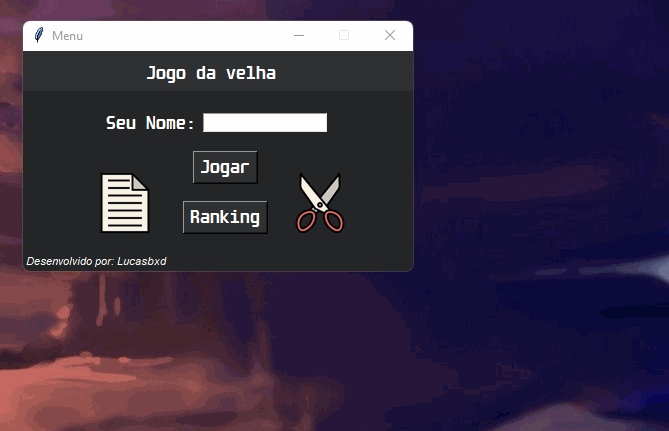

<h1 align="center" dir="auto">Jo Ken Po</h1>

<p align="center" dir="auto">
  
  
  
</p>

<p align="center" dir="auto">Jogo jo ken po (pedra papel e tesoura) criado em python com o foco em recriar a lógica por trás do jogo.</p>

<p align="center">
  <a href="#sobre">Sobre</a> -
  <a href="#funcoes">Funções</a> -
  <a href="#tecnologias">Tecnologias</a> -
  <a href="#pre-requisitos">Pré-requisitos</a> -
  <a href="#autor">Autor</a>
</p>

<p  align="center" dir="auto"></p>

<h2 id="sobre">📍 Sobre</h2>
<p>O objetivo do presente projeto é praticar a utilização do python em uma software, utilizando funções, classes e arrays para criar um jogo, que no caso é o jo ken po.</p>

<h2 id="funcoes">🎮 Funções</h2>
<p>As seguintes funções foram desenvolvidas no software:</p>
<ul>
  <li>Escolher entre Pedra Papel ou tesoura para fazer a sua jogada
  </li>
  <li>Acumular pontos:
    <ul>
      <li>Ao vencer do cpu o player ganha +1 ponto, caso perca o jogo reinicia.</li>
    </ul>
  </li>
  <li>Ranking:
  <ul>
    <li>Mostra apenas os três primeiros com a melhor pontuação.</li>
  </ul>
  </li>
</ul>

<h2 id="tecnologias">🛠 Tecnologias</h2>
<p>As seguintes ferramentas foram utilizadas para a construção do projeto:</p>
<ul>
  <li>Python</li>
  <li>Bibliotecas:
  <ul>
  <li>Tkinter</li>
  <li>PIL</li>
  <li>Random</li>
  <li>Operator</li>
  </ul>
</ul>

<h2 id="pre-requisitos">⚙️ Pré-requisitos</h2>
<p> Antes de começar é necessário instalar as seguintes ferramentas em sua máquina: <a href="https://git-scm.com">Git</a>, <a href="https://www.python.org/">Python</a> e <a href="yarnpkg.com">Yarn</a>. Com todos os programas instalados, execute as seguintes linhas de código:

<p>Instalando as bibliotecas do python:</p>

```bash
# PIL
$ pip install Pillow
```

<p>Rodando projeto em sua máquina:<p>

```bash
# clone este repositório
$ git clone https://github.com/Lucasbxd/Jo-ken-po

# acesse o repositório
$ cd Jo-ken-po

# Instale as dependências
$ yarn install

# Inicie a aplicação
$ yan start
```
---
<p id="autor">Made with by Lucasbxd <a target="blank" href="https://www.linkedin.com/in/lucasbxd/">💛 See my linkedin</a> | ícones obtidos através do site <a href="https://www.flaticon.com">flaticon</a>.</p>